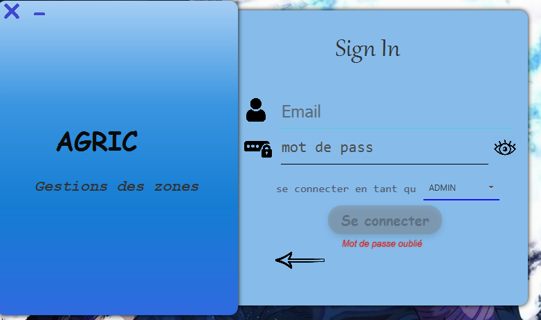
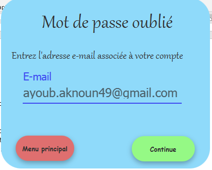
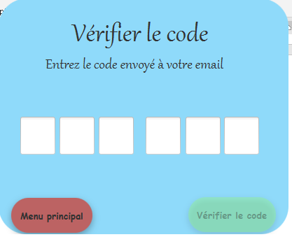
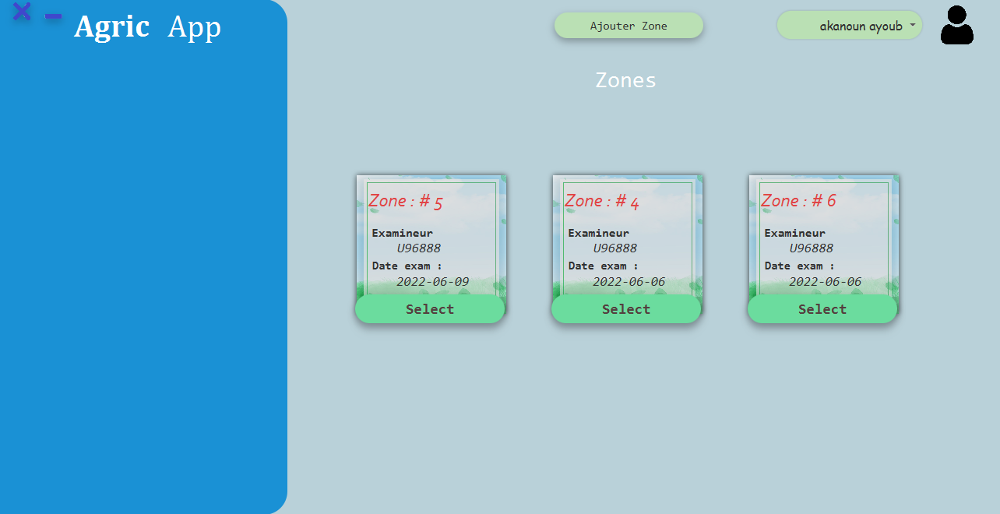
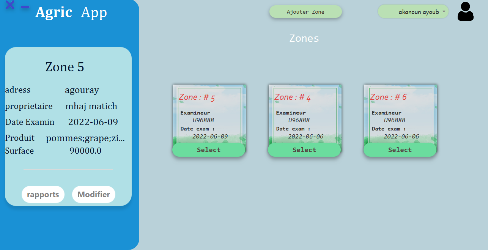
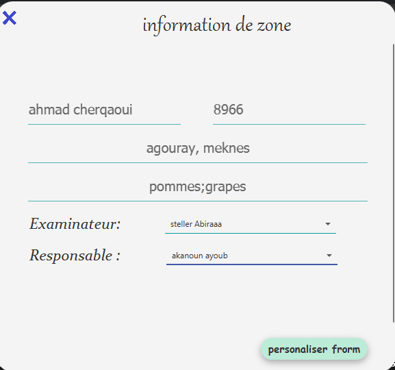
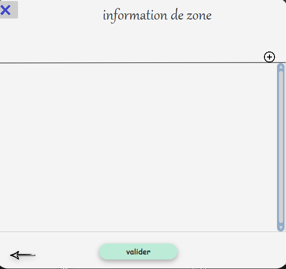
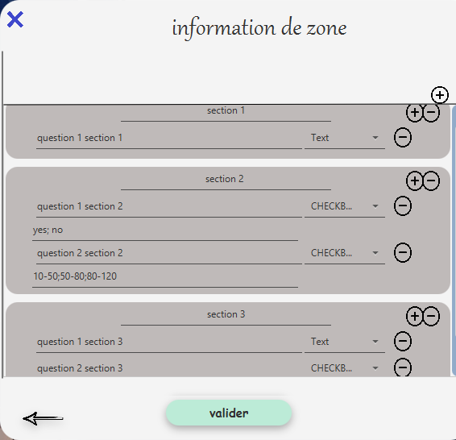
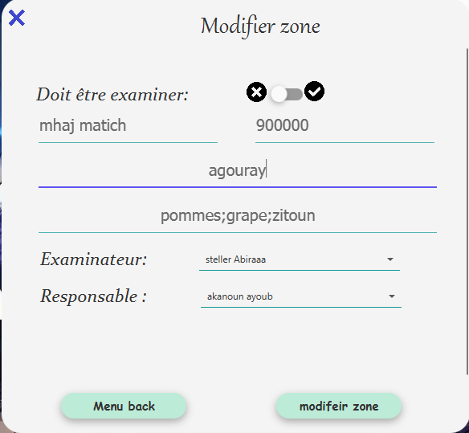
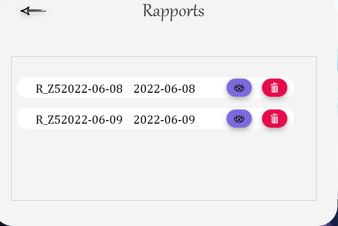

# Agricole Management Systeme

## Table of Contents

- [Introduction](#introduction)
- [Requirements](#requirements)
- [Installation](#installation)
- [Usage](#usage)
- [Application ScreenShots](#ScreenShots)

## Introduction

    This is an application for engineers to manage several resources related to agriculture,  
    including zones agricoles, employers, and creating templates for rapports. The application is built using JavaFX and Maven.

## Requirements

    To run this application, you will need the following:
- Java 15
- JavaFX 11
- Maven
## Installation

1. Clone this repository to your local machine.
2. Install the required dependencies by running `mvn install`.
3. Run the application using mvn `javafx:run`.

## Usage

    Upon launching the application, you will be presented with a login screen.  
    Enter your credentials to access the main dashboard, where you can manage the various resources.  

>#### Zones Agricoles  
    In the zones agricoles section, you can add, edit, or delete zones, as well as view details about each zone. You can also view a map of all zones, and filter by various criteria such as crop type or soil quality.
>#### Employers
    In the employers section, you can manage the employees who work on the agricole zones. You can add, edit, or delete employees, as well as view details about each employee. You can also assign employees to specific zones and view their work schedules.
>#### Rapports
    In the rapports section, you can create templates for various types of rapports, such as harvest reports or soil analysis reports. You can add fields and specify formatting options for each field, and save the template for future use.

## ScreenShots
    Login interface:

    Forget password interface :

    Verify code Interface :

    Email verification : 

    Zones Interface :
 
    
    Select Zone :

    Add zone :

    Constume rapport templat

    Modifie Zone 

    Rapports list 

    Show rapport

    Modifier compte infos 

